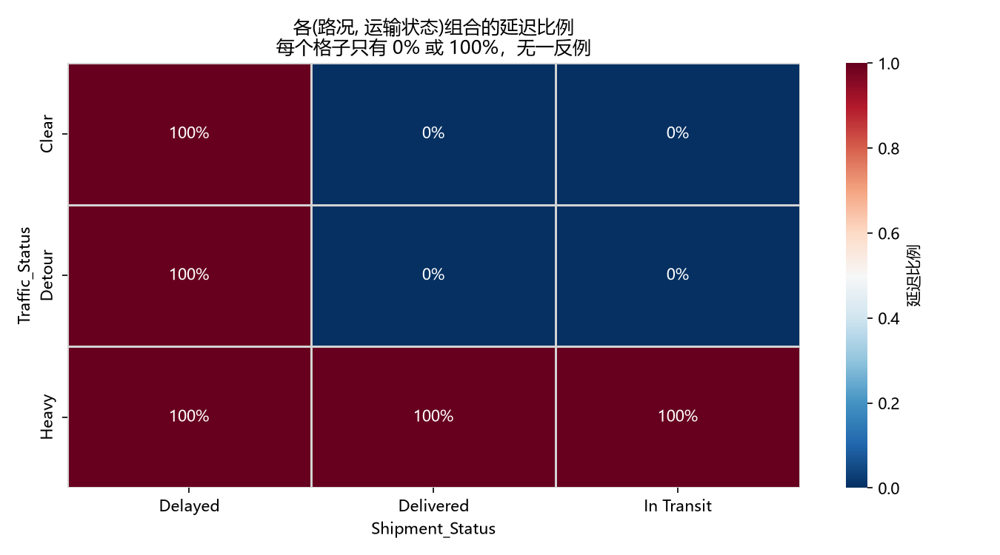
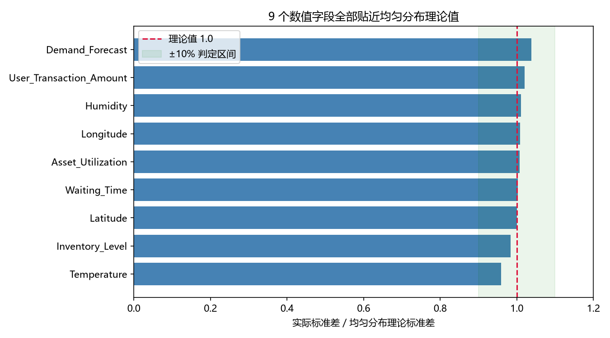

# 智能物流数据质量审计

> 一句话结论：这份看似完整的物流数据集**无法用于建模**，以下是完整证据链。

## TL;DR

- 目标变量 `Logistics_Delay` 由 `Shipment_Status` + `Traffic_Status` 完全决定，
  复现率 **1000/1000** → 严重**目标泄漏**
- 9/10 个数值字段通过均匀随机性检验（标准差/理论值 ∈ [0.96, 1.04]）→ **合成数据**
- 移除泄漏字段后，模型准确率从 **1.0000** 跌至 **0.5290**（52.9%），
  **低于** 0.5660（56.6%）的多数类基线 → 数据中不存在可学习的信号

## 我做了什么

把数据质量检测封装成可复用工具 `src/audit.py`（5 项检测 + 报告类），
配套 30 个 pytest 测试，并在 4 份公开数据集上验证了通用性。

| 检测 | 作用 |
|---|---|
| `detect_target_leakage` | 找出能完全复现目标变量的字段组合 |
| `test_uniformity` | 判断数值字段是否为均匀随机生成 |
| `check_label_consistency` | 找出标志位与原因字段的逻辑矛盾 |
| `check_extreme_ratio` | 找出 0% / 100% 这类不可能出现在真实数据的比例 |
| `class_balance` | 计算多数类基线，作为模型有效性的下限 |

## 主要结果

完整报告见 [`reports/audit_report.md`](reports/audit_report.md)，
跨数据集对比见 [`reports/cross_dataset_audit.md`](reports/cross_dataset_audit.md)。

## 如何复现

    git clone https://github.com/Shaohangtian/logistics-data-audit.git
    cd logistics-data-audit
    python -m venv .venv
    .venv\Scripts\activate
    pip install -r requirements.txt
    pytest tests/ -v
    python scripts/make_figures.py
    jupyter lab notebooks/

`data/external/` 中的跨数据集验证数据体积较大，未入库，
下载方式见 [`data/README.md`](data/README.md)。

## 来源与致谢

本项目基于 Kaggle 开源项目
[Logistics Supply Chain Analysis - Lean Six Sigma](https://www.kaggle.com/code/shivambhardwaj23/logistics-supply-chain-analysis-lean-six-sigma)
（作者 shivambhardwaj23）的 DMAIC 框架，
在此基础上独立完成了数据质量审计、统计量复算与错误修正。
详见 [`ATTRIBUTION.md`](ATTRIBUTION.md)。